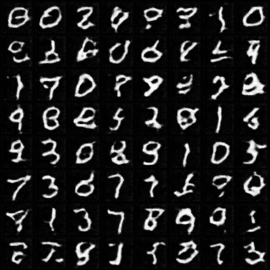
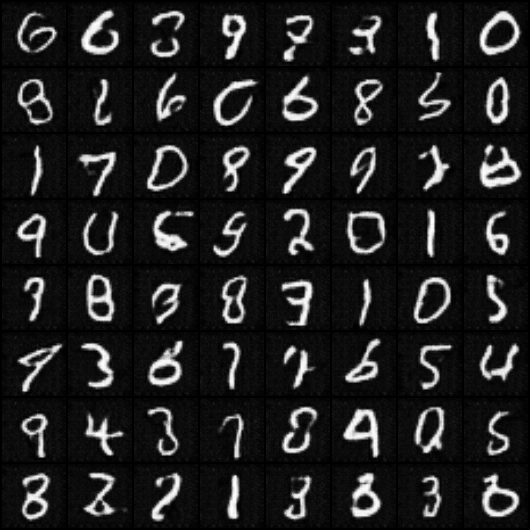
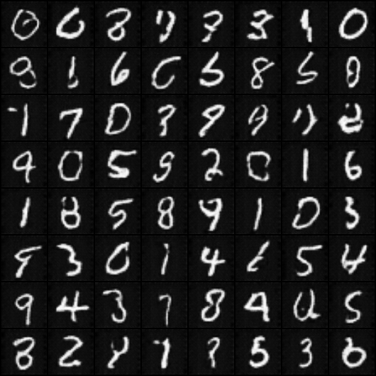

# GeneticGAN

GeneticGAN is a PyTorch project implementing two generative models:

1. **GAN-GA**: A DCGAN-based GAN integrated with a Genetic Algorithm (GA) to optimize latent vectors for better diversity and image quality.
2. **GAN**: A standard DCGAN for baseline comparison.

The goal is to generate high-quality images from an ImageFolder-style dataset and compare the models using **loss curves** and **FID scores**.

---

## 🔹 Generated Images

### GAN-GA Samples (Epoch 2, 6, 10)

<table>
<tr>
  <td align="center"> Epoch 2</td>
  <td align="center"> Epoch 6</td>
  <td align="center"> Epoch 10</td>
</tr>
</table>

> GAN-GA produces images with higher diversity and sharper details.

### GAN Samples

<table>
<tr>
  <td align="center"> Epoch 2</td>
  <td align="center"> Epoch 6</td>
  <td align="center"> Epoch 10</td>
</tr>
</table>

> GAN images are less diverse and slightly blurrier compared to GAN-GA.

---

## 🔹 Training Loss Comparison

**GAN-GA Losses:**  
  

**GAN Losses:**  
  

- GAN-GA shows more fluctuations in generator loss due to GA-based exploration, but this leads to better coverage of the latent space.
- GAN exhibits smoother but less diverse generator learning.
- Discriminator loss in both models stabilizes near zero, showing effective adversarial training.

---

## 🔹 FID Score Comparison

  

- **GAN-GA consistently achieves lower FID scores** across epochs compared to GAN.
- This demonstrates that GAN-GA generates images that are closer to the real data distribution.
- GAN improves gradually, but GAN-GA converges faster and stabilizes at a better FID.

---

## 🔹 Outcome Summary

- Integrating a Genetic Algorithm into GAN training improves image diversity and visual quality.
- GAN-GA outperforms GAN in both qualitative (image sharpness, diversity) and quantitative (FID score) evaluation.
- Loss curves show that while GAN-GA introduces higher variance in generator loss, it ultimately leads to better exploration and higher-quality generations.
- Conclusion: GAN-GA provides faster and more effective convergence than GAN, making it the stronger model for generative tasks.
---

## ⚡ Notes

- Results shown here are based on 10 training epochs only. The models can be further studied and improved by extending training to more epochs for deeper convergence.
- The dataset should be organized in ImageFolder format.
- GAN-GA supports RGB images, while Vanilla GAN supports grayscale.
-Outputs (images, plots) are saved in the outputs/ folder. 
